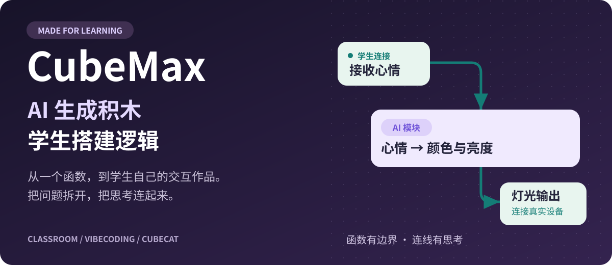
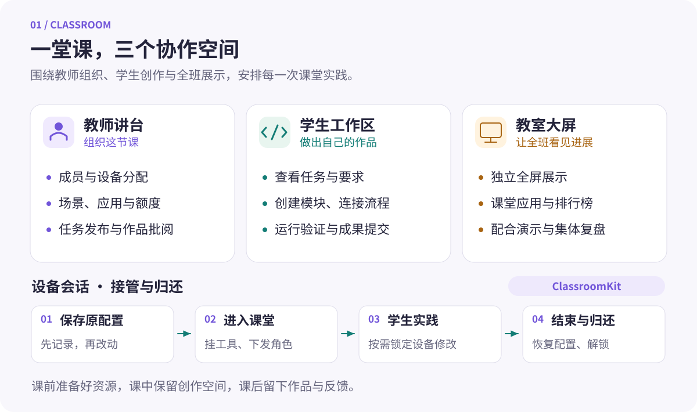
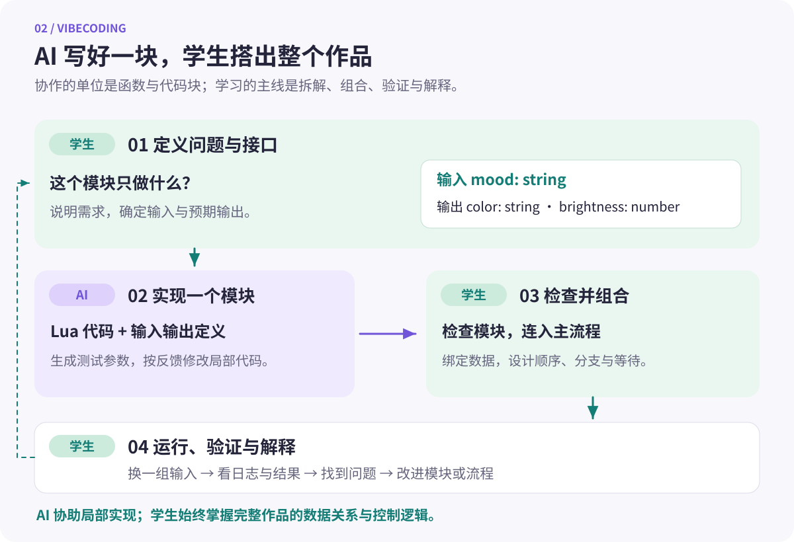
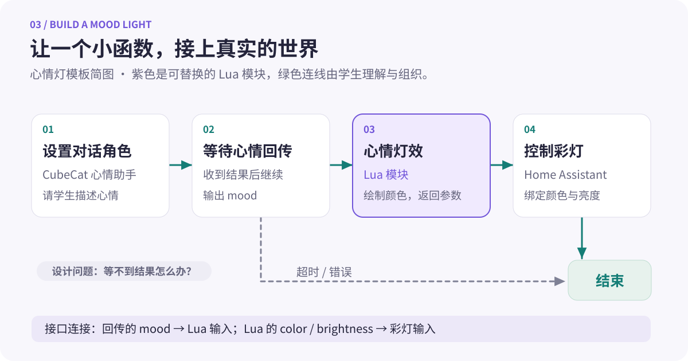

<div align="center">



# CubeMax

**面向课堂的 AI 创作与硬件编程平台**

让学生用自然语言创造代码积木，在可视化画布上搭出自己的逻辑，运行在看得见、摸得着的设备上。

[](LICENSE)
[](https://github.com/yibent/CubeMax/actions/workflows/docker-publish.yml)
[](package.json)
[](package.json)

[课堂设计](#classroom) · [VibeCoding](#vibecoding) · [课堂实例](#examples) ·
[快速开始](#quick-start) · [开发文档](#development)

</div>

CubeMax 将
**AI 辅助编程、可视化工作流、CubeCat（方糖猫）设备和课堂组织**放进同一个平台。教师可以准备班级、分配设备、布置任务和展示成果；学生可以创建函数与代码块、连接流程、调试作品并提交作业。

我们关注的是学生在创作过程中的主动思考：**问题怎么拆、数据怎么传、分支怎么选、失败怎么办，都由学生设计。AI 帮助实现其中一个个明确的小功能。**

| 想完成什么               | 从哪里开始                                         |
| ------------------------ | -------------------------------------------------- |
| 组织一节人工智能实践课   | 教师「讲台」：班级成员、设备、课堂应用、任务与额度 |
| 让学生做出自己的交互作品 | 编程工程：主流程、Lua 模块、仿真与设备运行         |
| 开展全班参与的课堂活动   | 「破解保险箱」：教师控制、学生参与、教室大屏       |
| 为学校扩展自己的教学应用 | ClassroomKit 与应用扩展 SDK                        |

<a id="classroom"></a>

## 为一间教室设计

课堂需要同时照顾几十位学生、共享设备和有限的课时。CubeMax 围绕**课前准备、课中实践、课后反馈**组织功能，让教学活动有开始、有反馈，也能正常收尾。



### 教师、学生和大屏，各有合适的工作区

| 课堂环节 | 已有设计                                           | 对教学的帮助                     |
| -------- | -------------------------------------------------- | -------------------------------- |
| 课前建班 | 管理成员身份，创建或导入学生账号，分配 CubeCat     | 提前准备好“谁用哪台设备”         |
| 准备活动 | 保存角色场景，用快捷指令批量切换设备配置           | 在不同教学任务之间切换           |
| 分层教学 | 向全班或指定学生发布任务，按学生控制应用可见范围   | 为不同进度的学生安排不同任务     |
| 管理资源 | 查看班级 AI 额度，给学生划拨或回收额度             | 按课程需要分配可用资源           |
| 学生创作 | 在「我的任务」查看作业，提交工作流或智能体         | 将自己的作品交回课堂             |
| 成果反馈 | 教师查看提交时的成果快照，给出评分与评语           | 结合学生实际提交的版本讨论和改进 |
| 全班展示 | 课堂应用有独立大屏入口；如「破解保险箱」显示排行榜 | 教师继续控制活动，投影屏专注展示 |

### 上课可以接管设备，下课能够归还

课堂应用通过 [ClassroomKit](docs/classroom-kit.md)
临时改变一批设备的角色与工具。开始前，平台先保存每台设备的原配置，再挂载工具和下发课堂提示词；活动结束时执行配置恢复、工具注销与解锁。会话带有过期时间，超时清理机制为忘记结束的活动提供兜底。

这套机制还照顾了几件课堂里常见的小事：

- **一部分设备离线**：批量操作返回逐台结果，教师可以看到哪些设备已准备好。
- **活动期间误改设置**：课堂会话可以临时锁定学生端的设备修改。
- **投影与教师电脑同时使用**：应用大屏使用独立的屏幕终端登录，不挤掉教师电脑的控制台会话。
- **新一局继续上课**：结束上一局并恢复配置后，再开始下一局，避免把游戏角色层层叠加。

<a id="vibecoding"></a>

## VibeCoding：AI 生成积木，学生搭建逻辑

**CubeMax 的 VibeCoding，以函数和代码块作为 AI 协作的基本单元。**
学生先说明某个模块应该接收什么、完成什么、返回什么，让 AI 协助写出局部实现；再亲手把这些模块组合成完整作品。

例如，与 AI 约定“输入一个心情，返回对应的颜色和亮度”，得到的就是一个可以理解、测试和重复使用的积木。学生继续决定：心情从哪里来？什么时候点亮？等待多久？没有收到结果又怎么办？



### 从一句描述，到一个可复用的节点

1. **学生拆解任务**：把作品分成输入、处理、判断、输出等小能力，确定每个模块的输入与输出。
2. **AI 协助写模块**：在 Lua 编辑器中描述需求，生成代码、输入输出定义和测试参数；修改后可以查看代码差异。
3. **学生检查与试跑**：阅读代码，改变测试输入，比较实际输出与预期，继续修改模块。
4. **学生搭建主流程**：把「我的模块」中的节点加入画布，连接数据，安排顺序、条件、循环、等待与错误分支。
5. **运行并解释作品**：在适用的仿真环境或真实设备上验证，观察日志与结果，解释设计，再迭代提交。

底层使用
**Lua 模块 + 输入输出 Schema + 可视化工作流**：Lua 负责实现一个具体能力，Schema 描述模块接口，工作流组织各个能力之间的数据和执行关系。已有模块会以「我的模块」节点出现在节点库中。

| AI 协助的部分                | 学生掌握的部分                   |
| ---------------------------- | -------------------------------- |
| 编写一个函数或模块的具体实现 | 拆解问题，决定需要哪些模块       |
| 生成输入输出定义与测试参数   | 检查接口，选择测试样例和预期结果 |
| 根据反馈修改局部代码         | 连接数据，设计执行顺序与分支     |
| 减少语法和重复实现的负担     | 判断结果，定位问题，解释整个系统 |

**学生的作品既包含运行效果，也包含他们设计的流程。**
课堂讨论可以沿着连线展开：“这个输出为什么接到这里？”“等待超时会走哪条路？”“换一组输入，结果应该怎样变化？”

<a id="examples"></a>

## 从一个小作品开始

### 心情灯：把对话、函数和现实设备连起来

仓库提供了「心情灯」应用工程模板：CubeCat 与学生聊心情，主流程等待心情回传，Lua 模块在设备屏幕上呈现颜色，再将颜色和亮度传给智能家居灯节点。智能家居部分通过
**Home Assistant** 接入。



一个适合讲解接口的**简化教学模块**如下。它只做心情到颜色的映射，采用项目中的 `main(params)`
入口和对象返回约定：

```lua
-- 输入：mood；输出：color、brightness
function main(params)
  local palette = {
    happy = { color = "#FFD54A", brightness = 80 },
    calm  = { color = "#80CBC4", brightness = 45 },
    sad   = { color = "#90CAF9", brightness = 35 }
  }

  return palette[params.mood] or palette.calm
end
```

在模块编辑器中，将输入 `mood` 定义为字符串，将输出 `color` 定义为字符串、`brightness`
定义为数字，便能把结果接到后续节点。可以用 `happy`、`sad`
和一个未知值分别试跑，检查正常输出与默认分支。

学生再来完成这些设计：

- 把回传数据中的 `mood` 绑定到模块输入。
- 把模块的 `color`、`brightness` 输出连接到彩灯节点。
- 为等待回传设置超时，并连接错误出口。
- 改变配色规则，或增加条件，让同一块积木服务于自己的作品。

上面的代码是教学简化示例；仓库的完整模板还包含屏幕灯效与更多心情类型，见
[应用工程模板源码](packages/api/src/modules/workflow/programming-project-templates.ts)。使用完整模板前，需要绑定支持 Lua 的 CubeCat；彩灯联动还需配置 Home
Assistant 与对应灯具。

### 破解保险箱：全班一起参与的 AI 对话实验

[「破解保险箱」](extensions/safe-cracker/README.md)
是仓库内已有的课堂应用。教师给方糖猫设置守护密码的角色，学生通过对话尝试发现密码，成功结果显示在教室大屏上。

| 教师准备                           | 学生实践                               | 全班复盘                       |
| ---------------------------------- | -------------------------------------- | ------------------------------ |
| 选择设备、设置角色提示词与游戏时长 | 与自己的方糖猫对话，调整提问策略       | 在大屏查看完成情况和排行榜     |
| 选择全班同一密码或每人不同密码     | 按教师设置，通过设备上报或页面提交密码 | 比较不同提问方式，讨论模型回应 |
| 开始活动，按需锁定学生设备设置     | 根据结果继续尝试                       | 结束活动，恢复设备配置         |

可以围绕这项活动讨论：角色提示词如何影响模型？相同问题为什么会得到不同回答？如何设计更清楚的规则？活动运行依赖已接入 MCP 的 CubeCat 设备。

## 从屏幕里的逻辑，到手边的作品

<table>
  <tr>
    <td align="center" width="50%">
      <br />
      <strong>CubeCat-S</strong>
    </td>
    <td align="center" width="50%">
      <br />
      <strong>CubeCat Lite</strong>
    </td>
  </tr>
</table>

<p align="center"><sub>仓库中的设备外观素材；具体能力取决于型号、固件与已连接的外设。</sub></p>

| 能力             | 可以探索的方向                           | 使用条件                                                  |
| ---------------- | ---------------------------------------- | --------------------------------------------------------- |
| 可视化工作流     | 数据传递、条件分支、循环、等待与工具调用 | 部署平台；模型节点需配置模型服务                          |
| AI 辅助 Lua 模块 | 小函数、屏幕交互、可复用代码积木         | 生成代码需可用的 LLM；执行需匹配运行环境                  |
| 浏览器仿真       | 测试仿真器支持的交互与设备能力           | 按仿真环境的能力范围编写模块                              |
| CubeCat 真机运行 | 屏幕绘制、设备交互、拍照等任务           | 支持相应能力的固件；远程 Lua 运行需开启远程脚本并连接平台 |
| MCP 与课堂应用   | 对话触发动作、设备上报、课堂互动         | 配置设备或工具的 MCP 连接                                 |
| Home Assistant   | 灯光与智能家居联动                       | 配置 Home Assistant 与支持的设备                          |
| 手机摄像头节点   | 手机采集图像，交给后续节点处理           | 已登录的 CubeMax iOS App、摄像头权限与在线连接            |

**仿真器和真机各有自己的能力范围。**
例如，部分 GPIO 接口只存在于网页仿真器；真机代码应以实际固件提供的模块为准。完整设备作品需要在目标设备上再验证一次。协议说明见
[ESP32 Lua](docs/esp32-lua-websocket-protocol.md) 与
[手机摄像头](docs/mobile-camera-websocket-protocol.md)。

<a id="quick-start"></a>

## 快速开始

### 本地开发

准备 **Node.js ≥ 22.20 且 < 23、pnpm 10.20.0**，以及 Docker
Compose（用于启动 PostgreSQL 和 Redis）。也可以使用自己已有的数据库与 Redis。

```bash
git clone https://github.com/yibent/CubeMax.git
cd CubeMax

corepack enable
corepack prepare pnpm@10.20.0 --activate
cp .env.example .env
```

编辑 `.env`：设置自己的
`JWT_SECRET`、数据库密码与 Redis 密码，确认数据库连接地址。已有数据库与 Redis 时，填写对应地址并跳过下一段的
`docker:infra:up`。

```bash
pnpm install --frozen-lockfile
pnpm docker:infra:up
pnpm sync-env
pnpm build --concurrency=3
pnpm dev:main
```

默认前端为 [http://localhost:4091](http://localhost:4091)，API 为
[http://localhost:4090](http://localhost:4090)。首次访问按初始化页面创建管理员账号，再配置模型服务。

开发配置中的 `DB_DEV_SYNCHRONIZE=true`
用于本地数据库结构同步，请为开发环境使用独立数据库。若修改了 PostgreSQL 或 Redis 的宿主机映射端口，也要同步调整
`.env` 中 API 使用的 `DB_PORT` / `REDIS_PORT`。

容器构建见 [Dockerfile](Dockerfile)，数据库、Redis、数据卷与端口设置见
[docker-compose.yml](docker-compose.yml)，配置项见
[.env.example](.env.example)。学校部署时应配置自己的域名、HTTPS、访问范围与持久化数据备份。

### 准备第一节课

1. **配置能力**：管理员配置可用模型；需要硬件时，先完成 CubeCat 账号绑定、设备连接和 MCP 接入。
2. **准备班级**：教师进入「讲台」，准备学生账号，分配设备、应用与 AI 额度。
3. **选择任务**：创建编程工程，或从「心情灯」「解密馆」模板开始；也可以安装并启动「破解保险箱」课堂应用。
4. **先试一遍**：用一个学生账号和一台目标设备完成任务、提交与收尾，再扩展到全班。
5. **课堂创作**：让学生说明模块接口、连接流程并运行；用提交快照和演示结果组织反馈。

<a id="development"></a>

## 开发与扩展

CubeMax 从 [BuildingAI](https://github.com/BidingCC/BuildingAI)
fork 而来，保留其模型、智能体、知识库与应用扩展基础，并持续发展课堂组织、设备协作和面向学生的编程体验。仓库使用 pnpm
monorepo；当前主要客户端为 React / Vite，后端为 NestJS，数据层使用 PostgreSQL 与 Redis。

| 入口                                                                       | 内容                                           |
| -------------------------------------------------------------------------- | ---------------------------------------------- |
| [packages/client](packages/client)                                         | 教师讲台、学生页面、工作流、Lua 编辑器与仿真器 |
| [packages/api](packages/api)                                               | 编程工程、工作流执行、Lua、班级与设备 API      |
| [packages/core/src/modules/classroom](packages/core/src/modules/classroom) | ClassroomKit 能力层                            |
| [extensions/safe-cracker](extensions/safe-cracker)                         | 完整课堂应用示例：教师端、学生端与大屏         |
| [apps/ios/CubeMax](apps/ios/CubeMax)                                       | CubeMax iOS 客户端源码                         |

常用构建与测试命令：

```bash
pnpm build --concurrency=3
pnpm build:web
pnpm --filter @buildingai/api test --runInBand
pnpm test:upstream
```

继续阅读：[课堂应用开发](docs/classroom-kit.md) · [工作流节点](docs/application-workflow-nodes.md) ·
[应用打包](docs/extension-packaging.md) · [ESP32 Lua 协议](docs/esp32-lua-websocket-protocol.md) ·
[手机摄像头协议](docs/mobile-camera-websocket-protocol.md)。

欢迎通过 [Issues](https://github.com/yibent/CubeMax/issues) 分享课堂需求、报告问题，或通过
[Pull Requests](https://github.com/yibent/CubeMax/pulls)
贡献模块、课堂应用、设备适配与文档。报告设备问题时，请附上型号、固件版本、复现步骤与脱敏日志；贡献教学案例时，欢迎说明学习目标、准备条件和验证过程。

## 致谢与许可

感谢 [BuildingAI](https://github.com/BidingCC/BuildingAI)
提供的开源基础，以及仓库所使用的各项开源依赖。CubeMax 采用
[Apache License 2.0](LICENSE)；各依赖与第三方服务遵循各自的许可和使用条款。

<p align="center"><strong>把实现交给 AI 协作，把设计与思考留在学生手中。</strong></p>
